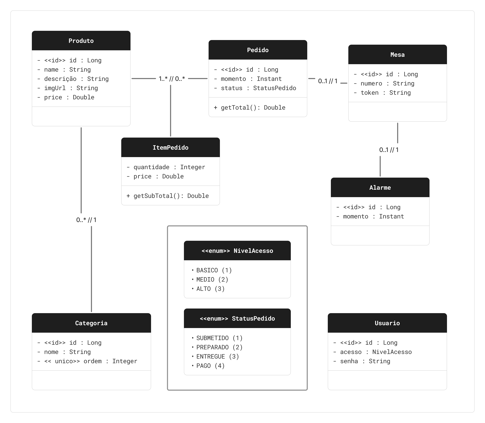

# LVGR - API de gerenciamento de restaurante

Projeto back-end em Java com Spring Boot para gerenciamento de restaurante. A API expoe recursos para mesas, pedidos, produtos, categorias, alarmes e validacao de acesso de usuario.

## Sumario
- Tecnologias
- Modelo de dominio
- Endpoints
- Como executar
- Documentacao da API (OpenAPI)
- Observacoes
- Licenca

## Tecnologias
- Java 21
- Spring Boot 4.0.3
- Spring Web MVC
- Spring Data JPA
- Springdoc OpenAPI (Swagger UI)
- MySQL
- Maven

## Modelo de dominio


## Endpoints

### Alarme
- `GET /alarmes`
- `GET /alarmes/{id}`
- `POST /alarmes`
- `PUT /alarmes/{id}`
- `DELETE /alarmes/{id}`

### Categoria
- `GET /categorias`
- `GET /categorias/{id}`
- `POST /categorias`
- `PUT /categorias` (atualizacao em lote)
- `PUT /categorias/{id}`
- `DELETE /categorias/{id}`

### CategoriaProduto
- `GET /cp`

### Mesa
- `GET /mesas`
- `GET /mesas/{id}`
- `GET /mesas/t/{s}`
- `POST /mesas`
- `PUT /mesas/{id}`
- `DELETE /mesas/{id}`

### Pedido
- `GET /pedidos`
- `GET /pedidos/{id}`
- `POST /pedidos`
- `PUT /pedidos/{id}`
- `DELETE /pedidos/{id}`

### Produto
- `GET /produtos`
- `GET /produtos/{id}`
- `POST /produtos` (multipart/form-data: `produto` + `file`)
- `PUT /produtos/{id}` (multipart/form-data: `produto` + `file` opcional)
- `DELETE /produtos/{id}`

### Usuario
- `GET /usuarios/{senha}`

## Como executar
Pre-requisitos:
- Java 21
- MySQL em execucao
- Maven (ou wrapper `mvnw`/`mvnw.cmd`)

1. Crie o banco `lvgr_db` no MySQL.
2. Ajuste as credenciais em `src/main/resources/application.properties` se necessario.
3. Execute a aplicacao:

```bash
./mvnw spring-boot:run
```

No Windows (PowerShell):

```powershell
.\mvnw.cmd spring-boot:run
```

Configuracao atual de banco (application.properties):
- URL: `jdbc:mysql://localhost:3306/lvgr_db?useSSL=false&serverTimezone=UTC`
- Usuario: `lvgr_api`
- Driver: `com.mysql.cj.jdbc.Driver`
- `spring.jpa.hibernate.ddl-auto=update`

## Documentacao da API (OpenAPI)
O projeto usa Springdoc OpenAPI v3 e possui um arquivo de especificacao pronto em `assets/api-docs.json`.

Para visualizar e testar no Swagger Editor:
1. Acesse `https://editor.swagger.io/`.
2. Clique em `File` > `Import file`.
3. Selecione o arquivo `assets/api-docs.json` deste projeto.
4. A documentacao sera carregada no editor.

Opcionalmente, com a aplicacao rodando, voce tambem pode acessar:
- Swagger UI: `http://localhost:8080/swagger-ui/index.html`
- JSON OpenAPI gerado em runtime: `http://localhost:8080/v3/api-docs`

## Observacoes
- O projeto possui upload de imagem de produtos.
- Diretorio de upload configurado em `app.upload.dir` no `application.properties`.
- A pasta alvo atual de upload esta em `D:/Projetos/JAVA/imagensLVGR`.

## Licenca
Este projeto esta licenciado sob a licenca MIT. Veja o arquivo `LICENSE` para mais detalhes.
